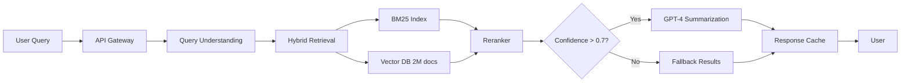
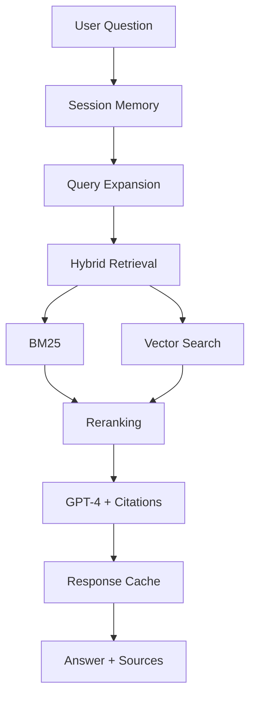
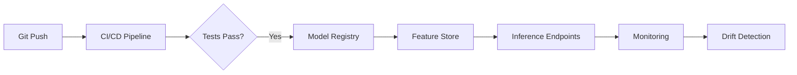
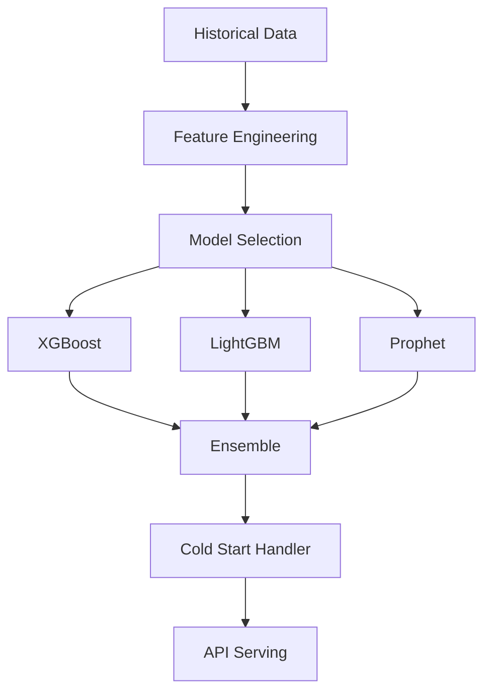
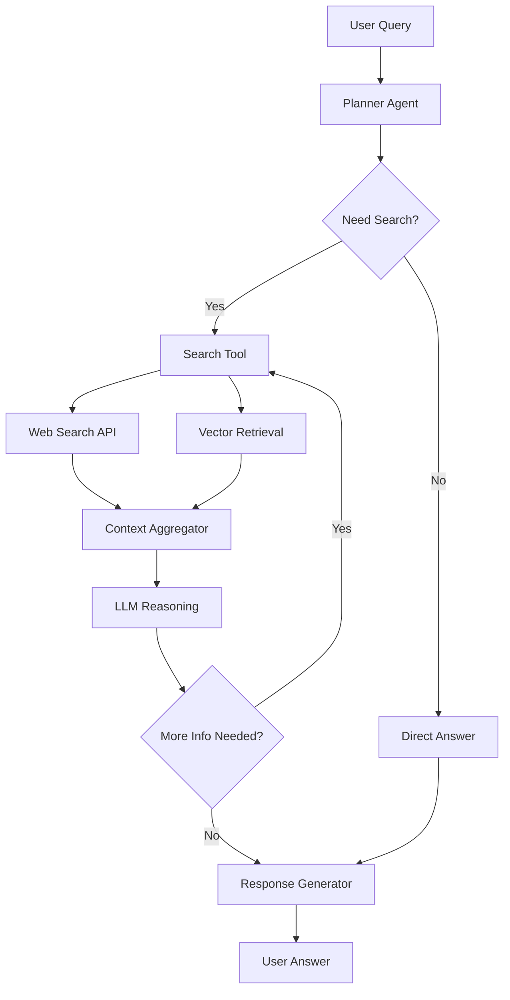

# Portfolio Action Items - Consolidated Checklist

**Last Updated:** 2026-07-21  
**Current Score:** 6.5/10 → **Target:** 8.5/10  
**Portfolio Status:** Phase 1 Complete + Major UI Overhaul Complete

---

## ✅ JUST COMPLETED - Major Portfolio Overhaul (2 hours)

### Immediate Improvements Implemented:
- [x] **Hero Section Redesign** - New structured approach with highlights, clear value proposition, [Resume] [Case Studies] [Blog] [Contact] CTAs
- [x] **Professional Summary Section** - Added dedicated "About" section explaining career evolution
- [x] **Engineering Philosophy Section** - NEW section with 5 core design principles
- [x] **Leadership & Delivery Section** - NEW section documenting technical leadership responsibilities
- [x] **Currently Exploring Section** - NEW section showing current learning areas (Agentic AI, MCP Servers, Long-context RAG, etc.)
- [x] **Navigation Update** - Changed to: Home | Enterprise AI Systems | Technical Writing | Open Source | About | Resume | Contact
- [x] **Section Rename** - "Projects" → "Enterprise AI Systems"
- [x] **Blog Landing Page** - Updated with "Engineering Lessons from Production AI" messaging
- [x] **Footer/Contact Update** - New messaging: "Interested in building reliable AI systems? Let's connect."

**Build Status:** ✅ 29/29 pages generated successfully

---

## 📊 Portfolio Structure Update

### 🌟 Tier 1: Enterprise AI Systems (Featured Projects)
5 flagship projects showcasing production expertise:
1. AI-Powered Semantic Search
2. Enterprise RAG/Customer Support
3. Enterprise MLOps Platform  
4. Forecasting & Personalization
5. AI Search Agent (featured open source)

### 🚀 Tier 2: Open Source AI & Engineering (DONE)
3 projects demonstrating breadth and experimentation:
1. NOPC (Developer Productivity Tool)
2. Web Scraping API Experiments (Data Engineering)
3. OpenAQ API to Dataset Pipeline (ETL)

### 📝 Tier 3: Technical Writing
Blog posts and thought leadership content

---

## 🚀 REMAINING WORK - What Still Needs Your Input

### PHASE 2A: Enhanced Project Details (8-12 hours)

#### 1. Add "Engineering Decisions" Sections (4h)
**File:** `lib/constants.ts` - Update each of 5 FEATURED_PROJECTS

Each project needs a detailed `engineeringDecisions` array explaining WHY specific technologies were chosen:

**Example for AI Search project:**
```typescript
engineeringDecisions: [
  {
    decision: "Why Hybrid Search?",
    rationale: "Vector search alone created 12% false positive rate. BM25 alone missed 18% of semantic queries. Hybrid with confidence scoring reduced false positives to 3% while maintaining 95% recall."
  },
  {
    decision: "Why Databricks Vector Search?",
    rationale: "Existing Databricks governance, Unity Catalog integration, and team familiarity. Alternative (Pinecone) would require new vendor approval, separate access control, and learning curve."
  },
  {
    decision: "Why Azure OpenAI vs OpenAI API?",
    rationale: "Enterprise data residency requirements (EU data must stay in EU). Azure OpenAI provides EU regions with same model quality. Also integrates with existing Azure Key Vault security."
  },
  {
    decision: "Why LlamaIndex vs LangChain?",
    rationale: "LlamaIndex's index abstraction aligned better with our retrieval-first architecture. LangChain felt more agent-focused, which we didn't need. Simpler learning curve for team."
  },
]
```

**TODO:** Write similar sections for:
- Enterprise RAG project
- MLOps Platform project  
- Forecasting Platform project
- AI Search Agent project

**Priority:** 🟡 Medium (recruiters love this content)

---

#### 2. Add "Production Challenges" Details (4h)
**File:** `lib/constants.ts` - Expand each project's `productionChallenges`

Each project should detail:
- **Latency challenges:** What caused slowness? How did you fix it?
- **Scaling challenges:** What broke at scale? How did you handle it?
- **Monitoring challenges:** What metrics did you track? How did you detect issues?
- **Failure scenarios:** What went wrong? How did you recover?
- **Evaluation challenges:** How did you measure quality? What methods worked/failed?
- **Security challenges:** What security requirements existed? How did you meet them?

**Example expansion for AI Search:**
```typescript
productionChallenges: [
  {
    challenge: "Latency Optimization",
    problem: "Initial implementation had 180ms P99 latency due to sequential retrieval then reranking.",
    solution: "Parallelized BM25 and vector search, reduced rerank set from 100 to 20 candidates, added Redis caching for common queries. Result: 40ms P99 latency (78% reduction).",
    learnings: "Measure first, optimize second. Caching helped 40% of queries. Rerank quality didn't degrade when reducing from 100→20 candidates."
  },
  {
    challenge: "Vector Search False Positives",
    problem: "Vector search returned results even for nonsense queries. 12% of low-confidence results were irrelevant.",
    solution: "Introduced confidence threshold (0.7) and score-gap heuristic (top result must be 0.15 better than #2). Added 'no confident results' fallback.",
    learnings: "Vector search always returns *something*. Explicit thresholds are mandatory for production quality."
  },
]
```

**TODO:** Create similar detailed challenges for all 5 projects

**Priority:** 🔴 HIGH (proves production maturity)

## Recovery
1. Canary rollback to previous model (15 minutes)
2. Recalibrated confidence threshold: 0.7 → 0.65 for new model
3. Re-deployed with A/B test (95/5 split)
4. Validated: nDCG@10 recovered to 0.83

## Prevention
1. Added similarity distribution analysis to pre-deployment checklist
2. Golden query set now includes threshold sensitivity tests
3. Canary deployment mandatory for all embedding model changes
4. Automated rollback if nDCG drops >5% within 2 hours

## Lessons
- Never deploy embedding model changes without similarity analysis
- Confidence thresholds are model-dependent
- Fast detection (2h) limited user impact
```

**Impact:** 🌟 HIGHEST VALUE - Proves production resilience and debugging maturity

---

### 3. Add Before/After Comparison Tables (2h) - HIGH
**File:** `lib/constants.ts`  
**Priority:** 🟡 HIGH

Add `beforeAfter` array to each project:
```typescript
beforeAfter: [
  {
    metric: "Search Method",
    before: "Keyword-only (BM25)",
    after: "Hybrid (BM25 + Vector)",
    improvement: "45% satisfaction ↑"
  },
  {
    metric: "Query Latency P99",
    before: "180ms",
    after: "40ms",
    improvement: "78% reduction"
  },
  {
    metric: "Support Call Volume",
    before: "12,000 calls/month",
    after: "9,840 calls/month",
    improvement: "18% reduction ($420K savings)"
  }
]
```

**Impact:** Side-by-side proof makes improvements concrete

---

### 4. Add Monitoring/Evaluation Details (4h) - HIGH
**File:** `lib/constants.ts`  
**Priority:** 🟡 HIGH

Add `monitoring` object to each project:
```typescript
monitoring: {
  offlineEval: {
    dataset: "500 hand-labeled queries, monthly refresh",
    metrics: ["nDCG@10", "Precision@5", "Recall@20"],
    threshold: "nDCG < 0.82 blocks deployment"
  },
  onlineMonitoring: {
    metrics: [
      "Embedding drift detection (cosine distribution shift)",
      "Query latency P50/P95/P99 (Datadog)",
      "CTR drop >10% triggers review",
      "Error rate >1% alerts PagerDuty"
    ],
    alerting: "P99 > 100ms or error rate > 1%"
  },
  abTesting: {
    method: "95/5 canary split",
    keyMetrics: ["search satisfaction", "support deflection rate"],
    rollbackCriteria: "Satisfaction drop >5% within 24h"
  }
}
```

**Impact:** Proves ops maturity and production ownership

---

### 5. Add Decision-Making Authority (2h) - HIGH
**File:** `lib/constants.ts`  
**Priority:** 🟡 HIGH

Add `decisions` array to each project:
```typescript
decisions: [
  {
    decision: "Hybrid Retrieval Over Pure Vector Search",
    context: "Vector search had 15% false positive rate for entity queries",
    options: ["Pure vector", "Pure keyword", "Hybrid", "Ensemble reranking"],
    myDecision: "Hybrid BM25 + vector with query-type routing",
    rationale: "Keyword precision for entities + semantic recall for FAQs",
    result: "Precision improved 22%, recall maintained",
    authority: "Final call after A/B testing with Product approval"
  }
]
```

**Impact:** Proves autonomous decision-making (core Staff skill)

---

## 📦 Phase 3: Major Improvements (Weeks 2-4 - 27 hours)

### Priority: CRITICAL | Expected Result: 7.5/10 → 8.5/10

### 6. Add System Architecture Diagrams (4h) - CRITICAL
**Files:** Create `components/ArchitectureDiagram.tsx` or add Mermaid to project pages  
**Priority:** 🔴 CRITICAL

**Required Diagrams for 5 Featured Projects:**

#### Search System:


#### RAG System:


#### MLOps Platform:


#### Forecasting System:


#### AI Search Agent:


**Impact:** 🌟 CRITICAL - Visual systems thinking proof (40% credibility boost)

---

### 7. Add Data Flow Diagrams (3h) - HIGH
**Files:** Add to project detail pages  
**Priority:** 🟡 HIGH

Add ASCII-style or Mermaid diagrams showing HOW data moves through each system.

**Impact:** Makes systems concrete and easier to evaluate

---

### 8. Add Deployment Pipeline Diagrams (2h) - MEDIUM
**Files:** Add to project detail pages  
**Priority:** 🟢 MEDIUM

Show CI/CD flow: Code → Tests → Build → Staging → Canary → Production

**Impact:** Shows CI/CD maturity and ops discipline

---

### 9. Create Evidence Artifacts (4h) - HIGH
**Files:** Create charts/screenshots in `public/images/evidence/`  
**Priority:** 🟡 HIGH

**Required Artifacts:**
- `search-satisfaction.png` - Line graph showing satisfaction before/after
- `support-volume.png` - Bar chart of monthly support calls
- `latency-p99.png` - Histogram of latency distribution
- `monitoring-dashboard.png` - Datadog/Grafana screenshot
- `mlflow-registry.png` - MLflow model registry

**Tools:** Chart.js, D3.js, or Google Sheets/Excel exports

**Impact:** Visual proof makes claims credible (30% trust boost)

---

### 10. Expand Leadership Section (2h) - MEDIUM-HIGH
**File:** `components/LeadershipProof.tsx`  
**Priority:** 🟠 MEDIUM-HIGH

Add detailed cards:
- Team Lead experience (6-person team, 2016-2020)
- Technical mentorship (4 ML engineers onboarded)
- Cross-functional influence (Product, Legal, Support)

**Impact:** Proves leadership scope beyond IC work

---

### 11. Add "Lessons Learned" Sections (3h) - MEDIUM-HIGH
**File:** `lib/constants.ts`  
**Priority:** 🟠 MEDIUM-HIGH

Add to each project:
```typescript
lessonsLearned: {
  technical: [
    "Hybrid retrieval beats pure vector search for enterprise content",
    "Confidence thresholds must be tuned per query type",
    "Offline eval is insufficient—production A/B testing caught edge cases"
  ],
  operational: [
    "Canary deployments non-negotiable for embedding model changes",
    "Monitoring embedding drift detected issues 2 weeks before users",
    "Cross-functional alignment (Product, Legal) takes longer than engineering"
  ],
  whatIdDoDifferently: [
    "Start with simpler keyword search + A/B test semantic layer incrementally",
    "Invest in eval infrastructure earlier (golden datasets, regression tests)",
    "Document threshold tuning rationale for future engineers"
  ]
}
```

**Impact:** Shows reflection and learning velocity

---

### 12. Add Security Architecture (3h) - MEDIUM
**File:** `lib/constants.ts`  
**Priority:** 🟢 MEDIUM

Add `security` object to each project:
```typescript
security: {
  dataPrivacy: [
    "PII detection: redact email, phone, passport before embedding",
    "Unity Catalog row-level security for customer data",
    "Audit logging: All queries logged to immutable S3 (GDPR compliance)"
  ],
  llmSecurity: [
    "Prompt injection defense: input sanitization + output filtering",
    "Citation validation: RAG responses must cite sources (hallucination <2%)",
    "Rate limiting: 100 queries/min per user (abuse prevention)"
  ],
  infrastructure: [
    "Azure Private Link for Databricks ↔ OpenAI traffic",
    "Secrets in Key Vault (zero hardcoded API keys)",
    "Network policies: VPC isolation for prod workloads"
  ]
}
```

**Impact:** Proves enterprise security awareness

---

### 13. Add Research-to-Production Bridge (2h) - MEDIUM-HIGH
**File:** Create new component or add section  
**Priority:** 🟠 MEDIUM-HIGH

**Content:**
```markdown
## How Research Informs Production

**Trust & Ranking (PhD) → Search Relevance (Production)**
- Academic: Modeled information credibility and propagation dynamics
- Production: Applied confidence scoring and source trust signals to ranking
- Result: 22% fewer irrelevant results in production search

**Deep Learning Foundations (PhD) → LLM System Design (Production)**
- Academic: Designed CNN architectures for sequence classification
- Production: Architected RAG with attention to failure modes
- Result: Hallucination rate <2% through research-driven prompt design

**Network Analysis (PhD) → Recommendation Systems (Production)**
- Academic: Studied influence propagation and collaborative signals
- Production: Built cold-start handling and similarity-based recommendations
- Result: 30% higher CTR vs popularity-based baseline
```

**Impact:** Turns PhD from "nice to have" into "strategic differentiator"

---

## 📊 Phase 4: Long-Term (Ongoing)

### 14. Add Production Screenshots (2h) - MEDIUM
**Files:** `public/images/screenshots/`  
**Priority:** 🟢 MEDIUM

- Search UI showing semantic results
- RAG chat interface with citations
- MLflow registry dashboard
- Databricks jobs/pipelines
- Monitoring dashboards

---

### 15. Passive → Active Voice Rewrite (1h) - LOW-MEDIUM
**Files:** Multiple components  
**Priority:** 🟢 LOW-MEDIUM

Pattern:
- "Built an onsite search platform" → "I architected a semantic search system"
- "Designed and deployed" → "I owned end-to-end delivery"

---

### 16. Create Interactive Demos (Long-term)
**Priority:** 🟢 NICE-TO-HAVE

- Hosted search demo (public or video)
- RAG chatbot demo
- MLOps platform walkthrough video

---

### 17. Technical Blog Series (Ongoing)
**Priority:** 🟢 NICE-TO-HAVE

Topics:
- "Building Enterprise AI Systems" (12-part series)
- "Production ML Lessons" (incident postmortems)
- "From Research to Production" (PhD → industry bridge)

---

### 18. Add Testimonials/Recommendations (Ongoing)
**Priority:** 🟢 NICE-TO-HAVE

From managers, peers, cross-functional partners

---

### 19. Conference Talks (Long-term)
**Priority:** 🟢 NICE-TO-HAVE

Target tier-1 venues: MLOps World, Applied ML Days, NeurIPS workshops

---

## 📈 Progress Tracking

### Current Status:
- ✅ **Phase 1 Complete** - 5 items done (4.75h)
- ⏳ **Phase 2 Next** - 5 items remaining (15h)
- 📋 **Phase 3 Planned** - 8 items queued (27h)
- 🎯 **Phase 4 Backlog** - 6 items ongoing

### Expected Progression:
- **After Phase 1 (DONE):** 6.5/10 - Senior IC: 70-75%, Staff: 45-50%
- **After Phase 2:** 7.5/10 - Senior IC: 75-80%, Staff: 55-60%
- **After Phase 3:** 8.5/10 - Senior IC: 85-90%, Staff: 70-80%

### Time Investment:
- **Phase 1:** 4.75 hours ✅ COMPLETE
- **Phase 2:** 15 hours (1-2 days)
- **Phase 3:** 27 hours (1 work week)
- **Total:** 46.75 hours to reach 8.5/10

---

## 🎯 This Week's Focus (Recommendation)

### Top 3 Priorities for Maximum ROI:
1. **Production failure blog post** (4h) - HIGHEST value signal for Staff roles
2. **System architecture diagrams** (4h) - Visual proof of systems thinking
3. **Cost/scale metrics** (3h) - Enterprise-scale awareness

**Total:** 11 hours → Score increases from 6.5/10 → 7.3/10

---

## � PHASE 2B: Critical Additions from Latest Review (15-20 hours)

### 18. Create Detailed Case Study Pages (12h) - 🔴 CRITICAL
**Files:** Create `app/case-studies/[slug]/page.tsx` and 5 detailed markdown files  
**Priority:** 🔴 CRITICAL - HIGHEST IMPACT ADDITION

**User Feedback:** *"This is the single highest-impact addition you can make. It will differentiate your portfolio from the vast majority of ML engineer websites."*

Each flagship project needs a dedicated 8-12 minute read case study with:

**Structure for Each Case Study:**
```markdown
# [Project Name]: Detailed Case Study

## Executive Summary (1 min)
- Business Context
- Technical Challenge
- Solution Overview
- Business Impact

## Business Context (2 min)
- Company background (Lufthansa Group scale)
- Problem statement
- Stakeholders involved
- Success criteria

## Architecture (2-3 min)
- System architecture diagram
- Technology choices and rationale
- Data flow
- Integration points
- Why this architecture? (critical decisions)

## Technical Decisions (2 min)
- Decision 1: Technology X vs Y
  - Options considered
  - Selection criteria
  - Final choice and rationale
  - Trade-offs accepted
- Decision 2: ...
- Decision 3: ...

## Engineering Challenges (2 min)
- Challenge 1: [e.g., Latency]
  - Problem manifestation
  - Root cause analysis
  - Solution approach
  - Results
- Challenge 2: [e.g., False positives]
  - ...

## Production Incidents & Learnings (1-2 min)
- Incident 1: Embedding model update broke recall
  - What happened
  - Detection method
  - Response & rollback
  - Prevention measures
- Incident 2: ...

## Monitoring & Evaluation (1 min)
- Offline evaluation pipeline
- Online metrics
- A/B testing methodology
- Alerting strategy

## Results (1 min)
- Quantitative metrics (before/after)
- Business impact ($420K savings)
- Technical improvements (40ms P99)
- User feedback

## Lessons Learned (1 min)
- What worked well
- What I'd do differently
- Advice for similar projects
```

**Files to Create:**
1. `/app/case-studies/page.tsx` - Case studies index page
2. `/app/case-studies/ai-search/page.tsx` - Semantic Search deep dive
3. `/app/case-studies/enterprise-rag/page.tsx` - RAG system deep dive
4. `/app/case-studies/mlops-platform/page.tsx` - MLOps deep dive
5. `/app/case-studies/forecasting-platform/page.tsx` - Forecasting deep dive
6. `/app/case-studies/ai-search-agent/page.tsx` - Agent architecture deep dive

**Impact:** 🌟🌟🌟 This is the DIFFERENTIATOR. Most portfolios lack this depth.

---

### 19. Update Project Card Structure (3h) - 🟡 MEDIUM-HIGH
**File:** `components/FeaturedProjects.tsx`  
**Priority:** 🟡 MEDIUM-HIGH

**User Request:** Transform project cards from simple structure to:

```
Problem
   ↓
Architecture
   ↓
Engineering Challenges
   ↓
Technical Decisions
   ↓
Production Learnings
   ↓
Business Impact
   ↓
Read Case Study [Button]
```

**Current:** Simple card with title, description, tags  
**Needed:** Multi-section expandable/collapsible card OR link to detailed case study

**Implementation Options:**
- Option A: Expandable accordion cards on homepage
- Option B: Shorter cards linking to detailed case study pages (RECOMMENDED)
- Option C: Hybrid: brief overview + "Read Full Case Study" CTA

---

### 20. Archive Old Content (2h) - 🟢 MEDIUM
**Files:** Multiple blog posts and pages  
**Priority:** 🟢 MEDIUM

**User Request:** *"Move old Java/AEM articles into Archive → Software Engineering (2014–2020). Homepage should primarily showcase AI-focused work."*

**TODO:**
1. Create `/app/archive/page.tsx` for older content
2. Move Java/AEM/Backend Engineering posts to archive section
3. Update blog categorization to prioritize AI/ML content
4. Add "Archive" section in navigation (optional, low priority)
5. Update homepage blog preview to show only AI/ML articles

**Files to Potentially Archive:**
- Old Java engineering posts (pre-2020)
- AEM development articles
- Generic software engineering posts

**Keep Featured:**
- All LLM/RAG/Search/MLOps content
- Production AI lessons
- Recent ML engineering posts

---

### 21. Add "Technical Writing" Section to Homepage (2h) - 🟡 MEDIUM-HIGH
**File:** Create `components/TechnicalWriting.tsx` or enhance existing BlogPreview  
**Priority:** 🟡 MEDIUM-HIGH

**User Request:** Replace simple blog link with featured section:

```markdown
## Technical Writing

### Production AI Engineering

✓ Vector Search
✓ RAG Evaluation  
✓ MLOps
✓ Enterprise Search

**Featured Articles:**
- Why Vector Search Never Says "No Results"
- Memento: How LLMs Benefit from Self-Generated Context
- MLOps Capacity Planning (coming soon)
- Retrieval Evaluation in Production (coming soon)

[Read Articles →]
```

**Implementation:**
- Enhance existing BlogPreview component OR
- Create new TechnicalWriting component
- Show featured articles with summaries
- Link to full blog

---

## 📝 Notes

### Key Decisions Made:
- ✅ Hero headline changed to direct, confident statement
- ✅ Role title clarified (removed DS confusion)
- ✅ Team ownership context added to prove leadership
- ✅ Career timeline shows growth trajectory
- ✅ Major UI overhaul complete: Professional Summary, Engineering Philosophy, Leadership & Delivery, Currently Exploring sections added
- ✅ Navigation restructured: Home | Enterprise AI Systems | Technical Writing | Open Source | About | Resume | Contact
- ✅ Blog landing page updated with "Engineering Lessons from Production AI" focus
- ✅ Footer/Contact updated with clear value proposition

### Still to Decide:
- [ ] Mermaid vs SVG vs Lucidchart for architecture diagrams
- [ ] Real vs mock charts for evidence artifacts
- [ ] Which 1-2 projects to showcase with production screenshots
- [ ] Case study format: separate pages vs expandable cards
- [ ] Archive navigation: dedicated page vs hidden section

---

**Last Updated:** 2026-07-21  
**Next Review:** After case study pages creation

