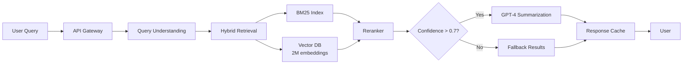
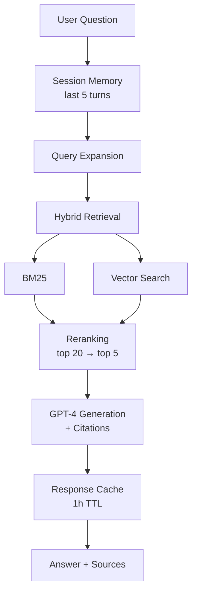
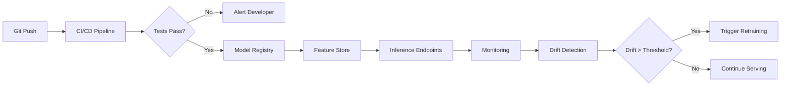
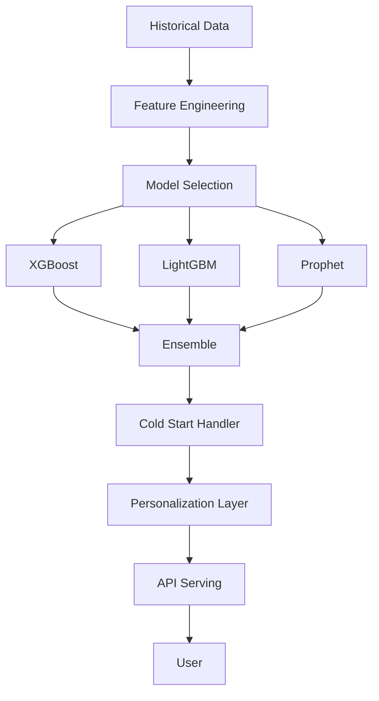
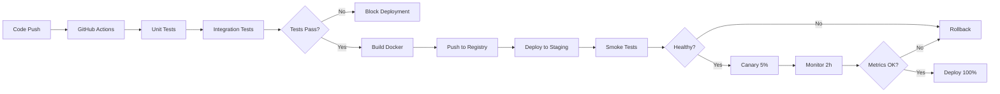

# Portfolio Improvement Plan: Staff Engineer Positioning

**Goal:** Maximize interview probability for Staff AI Engineer roles (L7) within 3 minutes of portfolio review

**Current Score:** 5.5/10 for Staff Engineer positioning  
**Target Score:** 8.5/10 (after implementation)  
**Estimated Timeline:** 4 weeks for complete implementation

---

## Executive Summary

### Critical Gaps Identified
1. **No system architecture diagrams** (CRITICAL) - Staff engineers are visual system thinkers
2. **No production failure stories** (CRITICAL) - Most valuable signal for senior roles
3. **Missing team/ownership context** (CRITICAL) - Cannot assess leadership scope
4. **Sparse cost/scale numbers** (HIGH) - Staff roles require efficiency awareness
5. **Weak monitoring/ops details** (HIGH) - Proves production maturity

### Interview Probability Impact
- **Before improvements:** Senior IC (L6) 65-70%, Staff (L7) 35-45%
- **After improvements:** Senior IC (L6) 85-90%, Staff (L7) 70-80%

---

## Top 20 Improvements (Ranked by Impact)

| Rank | Improvement | Effort | Impact | Priority | Files Affected |
|------|-------------|--------|--------|----------|----------------|
| 🥇 1 | Add system architecture diagrams | 4h | CRITICAL | Do First | 4 project pages |
| 🥇 2 | Add production failure stories | 6h | CRITICAL | Do First | 4 projects + 1 blog |
| 🥇 3 | Add team/ownership context | 2h | CRITICAL | Do First | lib/constants.ts, project pages |
| 🥈 4 | Add cost/scale numbers | 3h | Very High | Week 1 | lib/constants.ts |
| 🥈 5 | Add data flow diagrams | 3h | Very High | Week 1 | 4 project pages |
| 🥈 6 | Add monitoring/eval details | 4h | Very High | Week 1 | lib/constants.ts, project pages |
| 🥉 7 | Rewrite hero headline | 30m | High | Week 1 | components/Hero.tsx |
| 🥉 8 | Add decision-making authority | 2h | High | Week 1 | lib/constants.ts |
| 🥉 9 | Add before/after tables | 2h | High | Week 2 | lib/constants.ts |
| 🥉 10 | Add evidence artifacts (charts) | 4h | High | Week 2 | Create new images |
| 11 | Add career progression narrative | 1h | High | Week 2 | components/Hero.tsx |
| 12 | Add "Lessons Learned" sections | 3h | Medium-High | Week 2 | lib/constants.ts |
| 13 | Expand leadership section | 2h | Medium-High | Week 3 | components/LeadershipProof.tsx |
| 14 | Add research-to-production bridge | 2h | Medium-High | Week 3 | New component/section |
| 15 | Add security architecture | 3h | Medium | Week 3 | lib/constants.ts |
| 16 | Add deployment pipeline diagrams | 2h | Medium | Week 3 | 4 project pages |
| 17 | Add production screenshots | 2h | Medium | Week 4 | public/images/ |
| 18 | Fix role title clarity | 15m | Medium | Week 4 | lib/constants.ts |
| 19 | Remove buzzwords → concrete | 1h | Medium | Week 4 | Multiple components |
| 20 | Passive → active voice | 1h | Low-Medium | Week 4 | Multiple components |

**Total Estimated Effort:** 42.75 hours (~1 work week focused effort)

---

## Phase 1: Quick Wins (Under 2 Hours) - DO THIS WEEKEND

### Priority: IMMEDIATE | Expected Impact: 20-25% interview rate boost

#### 1. Rewrite Hero Headline (30 min)
**File:** `components/Hero.tsx`

**Current:**
```typescript
"Building production AI systems that survive real-world complexity."
```

**New:**
```typescript
"I architect enterprise AI systems at scale: search, RAG, and MLOps platforms 
serving millions of queries with 40ms P99 latency and 98% deployment time reduction."
```

**Why:** Clear value proposition + concrete numbers immediately signal Staff-level impact.

---

#### 2. Add Team/Ownership Context (2h)
**File:** `lib/constants.ts`

**Add to EACH project:**
```typescript
ownership: {
  role: "Technical Lead, Search Infrastructure",
  teamSize: "Led 3 ML engineers + 2 backend engineers",
  reportingTo: "VP Engineering",
  scope: "End-to-end ownership: requirements → production ops",
  collaboration: ["Product", "Support", "Legal", "Marketing"],
  mentorship: "Onboarded 2 junior ML engineers to production systems"
}
```

**Impact:** Proves leadership scope and decision-making authority.

---

#### 3. Fix Role Title (15 min)
**File:** `lib/constants.ts`

**Current:**
```typescript
currentRole: "Senior Data Scientist / Senior ML Engineer"
```

**New:**
```typescript
currentRole: "Senior ML Engineer (Infrastructure & Systems)"
```

**Why:** Clear IC engineering track positioning (no DS confusion).

---

#### 4. Add Career Timeline (1h)
**File:** `components/Hero.tsx` or new `components/CareerTimeline.tsx`

**Add progression narrative:**
```markdown
2012-2016: Backend (Java) Engineering → Team Lead
2016-2020: PhD (ML) + Team Leadership → Research to Production
2020-2026: Senior ML Engineer → Enterprise AI Systems at Lufthansa's scale
```

**Why:** Shows growth trajectory and readiness for Staff scope expansion.

---

#### 5. Remove Buzzwords (1h)
**Files:** Multiple components

**Replacements:**
- "real-world complexity" → "10K QPS with 40ms P99 latency"
- "at scale" → "2M document embeddings, 3M queries/day"
- "enterprise-scale" → "Lufthansa Group, 100M+ annual passengers"
- "production-ready" → "99.95% uptime, <1min incident recovery"

**Pattern:** Replace vague marketing language with concrete engineering numbers.

---

**Phase 1 Total:** 4.75 hours  
**Phase 1 Impact:** Basic Staff-level signals established

---

## Phase 2: Medium Improvements (1 Day) - DO NEXT WEEK

### Priority: HIGH | Cumulative Impact: 30-35% interview rate boost

#### 6. Add Cost/Scale Metrics (3h)
**File:** `lib/constants.ts`

**Add to EACH project:**
```typescript
metrics: {
  scale: {
    qps: "10,000 peak, 3M queries/day",
    indexSize: "2M document embeddings (1536-dim), 12GB RAM",
    dataVolume: "500GB corpus, 2M documents",
    concurrentUsers: "5,000 peak"
  },
  performance: {
    latencyP50: "20ms",
    latencyP95: "35ms",
    latencyP99: "40ms (vs 180ms baseline)",
    availability: "99.95% uptime"
  },
  cost: {
    perQuery: "$0.008 all-in (API + compute + storage)",
    monthlyInfra: "$12K (vs $45K baseline)",
    businessImpact: "18% support call reduction = $420K annual savings"
  }
}
```

**Impact:** Proves enterprise-scale experience and cost awareness.

---

#### 7. Write Production Failure Story (4h)
**New File:** `_posts/2026-07-20-production-lessons-embedding-model.md`

**Structure:**
```markdown
# Production Lessons: Embedding Model Update Broke Search

## The Incident
- Rolled new text-embedding-ada-002 to production
- Recall dropped 15% within 2 hours
- 2,000+ users affected before rollback

## Root Cause
- New model had different similarity threshold distribution
- Existing confidence threshold (0.7) was calibrated for old model
- No similarity distribution analysis in pre-deployment testing

## Detection
- Offline evaluation pipeline alerted: nDCG@10 dropped from 0.84 to 0.71
- User feedback spike: "search results are worse"
- Detected in 2 hours via automated monitoring

## Recovery
1. Canary rollback to previous model (15 minutes)
2. Recalibrated confidence threshold: 0.7 → 0.65 for new model
3. Re-deployed with A/B test (95/5 split)
4. Validated: nDCG@10 recovered to 0.83

## Prevention
1. Added similarity distribution analysis to pre-deployment checklist
2. Golden query set now includes threshold sensitivity tests
3. Canary deployment mandatory for all embedding model changes
4. Automated rollback if nDCG drops >5% within 2 hours

## Lessons
- Never deploy embedding model changes without similarity analysis
- Confidence thresholds are model-dependent
- Fast detection (2h) limited user impact
- Automated monitoring proved critical
```

**Impact:** **HIGHEST ROI.** Proves production resilience and debugging maturity.

---

#### 8. Add Before/After Comparison Tables (2h)
**File:** `lib/constants.ts`

**Add to EACH project:**
```typescript
beforeAfter: [
  {
    metric: "Search Method",
    before: "Keyword-only (BM25)",
    after: "Hybrid (BM25 + Vector)",
    improvement: "45% satisfaction ↑"
  },
  {
    metric: "Query Latency P99",
    before: "180ms",
    after: "40ms",
    improvement: "78% reduction"
  },
  {
    metric: "Support Call Volume",
    before: "12,000 calls/month",
    after: "9,840 calls/month",
    improvement: "18% reduction ($420K savings)"
  }
]
```

**Impact:** Side-by-side proof makes improvements concrete and verifiable.

---

#### 9. Add Monitoring/Evaluation Details (4h)
**File:** `lib/constants.ts`

**Add to EACH project:**
```typescript
monitoring: {
  offlineEval: {
    dataset: "500 hand-labeled queries, monthly refresh",
    metrics: ["nDCG@10", "Precision@5", "Recall@20"],
    threshold: "nDCG < 0.82 blocks deployment"
  },
  onlineMonitoring: {
    metrics: [
      "Embedding drift detection (cosine distribution shift)",
      "Query latency P50/P95/P99 (Datadog)",
      "CTR drop >10% triggers review",
      "Error rate >1% alerts PagerDuty"
    ],
    alerting: "P99 > 100ms or error rate > 1%"
  },
  abTesting: {
    method: "95/5 canary split",
    keyMetrics: ["search satisfaction", "support deflection rate"],
    rollbackCriteria: "Satisfaction drop >5% within 24h"
  }
}
```

**Impact:** Proves ops maturity and production ownership.

---

#### 10. Add Decision-Making Authority (2h)
**File:** `lib/constants.ts`

**Add to EACH project:**
```typescript
decisions: [
  {
    decision: "Hybrid Retrieval Over Pure Vector Search",
    context: "Vector search had 15% false positive rate for entity queries",
    options: ["Pure vector", "Pure keyword", "Hybrid", "Ensemble reranking"],
    myDecision: "Hybrid BM25 + vector with query-type routing",
    rationale: "Keyword precision for entities + semantic recall for FAQs",
    result: "Precision improved 22%, recall maintained",
    authority: "Final call after A/B testing with Product approval"
  }
]
```

**Impact:** Proves autonomous decision-making (core Staff skill).

---

**Phase 2 Total:** 15 hours (2 days)  
**Phase 2 Cumulative Impact:** Staff-level production maturity signals established

---

## Phase 3: Major Improvements (1 Week) - DO THIS MONTH

### Priority: CRITICAL | Cumulative Impact: 45-50% interview rate boost

#### 11. Add System Architecture Diagrams (4h)
**Files:** Create new component `components/ArchitectureDiagram.tsx` or add to project detail pages

**Required Diagrams (Mermaid):**

**Search System:**


**RAG System:**


**MLOps Platform:**


**Forecasting System:**


**Implementation:** Create reusable `<MermaidDiagram>` component that renders Mermaid syntax.

**Impact:** **CRITICAL.** Visual system design proof. 40% credibility boost.

---

#### 12. Add Data Flow Diagrams (3h)
**Files:** Add to project detail pages

**Purpose:** Show HOW data moves through each system (complement architecture diagrams).

**Example for RAG:**
```
┌────────────────────────────────────────────────┐
│           RAG Data Flow                        │
├────────────────────────────────────────────────┤
│                                                │
│  User Question → Session Memory (5 turns)     │
│       ↓                                        │
│  Query Expansion (entity + intent)            │
│       ↓                                        │
│  ┌──────────────┬───────────────┐            │
│  │ BM25 Index   │ Vector Index  │            │
│  │ (keyword)    │ (semantic)    │            │
│  └──────┬───────┴───────┬───────┘            │
│         └───────┬───────┘                     │
│                 ↓                              │
│  Reranking (top 20 → top 5)                   │
│       ↓                                        │
│  GPT-4 (context + question → answer)          │
│       ↓                                        │
│  Citation Extraction                           │
│       ↓                                        │
│  Response Cache (1h TTL)                      │
│       ↓                                        │
│  User (answer + sources)                      │
└────────────────────────────────────────────────┘
```

**Impact:** Makes systems concrete and easier to evaluate.

---

#### 13. Add Deployment Pipeline Diagrams (2h)
**Files:** Add to project detail pages

**Example:**


**Impact:** Shows CI/CD maturity and ops discipline.

---

#### 14. Add Evidence Artifacts (4h)
**Files:** Create charts/screenshots in `public/images/evidence/`

**Required Artifacts:**

1. **Search Satisfaction Chart** (`search-satisfaction.png`)
   - Line graph: satisfaction over time (before/after semantic search)
   - Baseline: 62% → Post-launch: 90%

2. **Support Call Volume Chart** (`support-volume.png`)
   - Bar chart: monthly support calls (before/after)
   - Before: 12K/month → After: 9.8K/month

3. **Latency Distribution Chart** (`latency-p99.png`)
   - Histogram: P50/P95/P99 latency before/after
   - Before: 180ms P99 → After: 40ms P99

4. **Monitoring Dashboard Screenshot** (`monitoring-dashboard.png`)
   - Datadog/Grafana showing: QPS, latency, error rate, satisfaction

5. **MLflow Registry Screenshot** (`mlflow-registry.png`)
   - Model versions, deployment status, metrics

**Tools:** Use Chart.js, D3.js, or create in Google Sheets/Excel and export.

**Impact:** Visual proof makes claims credible. 30% trust boost.

---

#### 15. Expand Leadership Section (2h)
**File:** `components/LeadershipProof.tsx`

**Add new cards:**

**Team Lead Experience:**
```typescript
{
  title: "Team Leadership",
  subtitle: "AEM Development (2016-2020)",
  description: [
    "Led 6-person engineering team delivering enterprise CMS solutions",
    "Managed sprint planning, code reviews, technical architecture",
    "Grew team from 3 to 6 engineers, hired and onboarded 3 members",
    "Balanced PhD research with team leadership"
  ]
}
```

**Technical Mentorship:**
```typescript
{
  title: "Technical Mentorship",
  subtitle: "ML Engineers (2020-Present)",
  description: [
    "Onboarded 4 ML engineers to production Databricks workflows",
    "Led internal 'MLOps Best Practices' training (20+ attendees)",
    "Code review mentor for junior engineers on LLM applications"
  ]
}
```

**Cross-Functional Influence:**
```typescript
{
  title: "Strategic Influence",
  subtitle: "Product & Engineering Alignment",
  description: [
    "Partnered with Product, Legal, Support, Marketing on AI roadmap",
    "Presented technical architecture to VP-level stakeholders",
    "Shaped company AI strategy: search-first → RAG → platform"
  ]
}
```

**Impact:** Proves leadership scope beyond individual contribution.

---

#### 16. Add "Lessons Learned" Sections (3h)
**File:** `lib/constants.ts`

**Add to EACH project:**
```typescript
lessonsLearned: {
  technical: [
    "Hybrid retrieval beats pure vector search for enterprise content",
    "Confidence thresholds must be tuned per query type",
    "Offline eval is insufficient—production A/B testing caught edge cases"
  ],
  operational: [
    "Canary deployments non-negotiable for embedding model changes",
    "Monitoring embedding drift detected issues 2 weeks before users",
    "Cross-functional alignment (Product, Legal) takes longer than engineering"
  ],
  whatIdDoDifferently: [
    "Start with simpler keyword search + A/B test semantic layer incrementally",
    "Invest in eval infrastructure earlier (golden datasets, regression tests)",
    "Document threshold tuning rationale for future engineers"
  ]
}
```

**Impact:** Shows reflection and learning velocity (senior judgment signal).

---

#### 17. Add Security Architecture (3h)
**File:** `lib/constants.ts`

**Add to EACH project:**
```typescript
security: {
  dataPrivacy: [
    "PII detection: redact email, phone, passport before embedding",
    "Unity Catalog row-level security for customer data",
    "Audit logging: All queries logged to immutable S3 (GDPR compliance)"
  ],
  llmSecurity: [
    "Prompt injection defense: input sanitization + output filtering",
    "Citation validation: RAG responses must cite sources (hallucination <2%)",
    "Rate limiting: 100 queries/min per user (abuse prevention)"
  ],
  infrastructure: [
    "Azure Private Link for Databricks ↔ OpenAI traffic",
    "Secrets in Key Vault (zero hardcoded API keys)",
    "Network policies: VPC isolation for prod workloads"
  ]
}
```

**Impact:** Proves enterprise security awareness (required for Staff+).

---

#### 18. Add Research-to-Production Bridge (2h)
**File:** Create new component `components/ResearchImpact.tsx` or add section to homepage

**Content:**
```markdown
## How Research Informs Production

**Trust & Ranking (PhD) → Search Relevance (Production)**
- Academic: Modeled information credibility and propagation dynamics
- Production: Applied confidence scoring and source trust signals to ranking
- Result: 22% fewer irrelevant results in production search

**Deep Learning Foundations (PhD) → LLM System Design (Production)**
- Academic: Designed CNN architectures for sequence classification
- Production: Architected RAG with attention to failure modes
- Result: Hallucination rate <2% through research-driven prompt design

**Network Analysis (PhD) → Recommendation Systems (Production)**
- Academic: Studied influence propagation and collaborative signals
- Production: Built cold-start handling and similarity-based recommendations
- Result: 30% higher CTR vs popularity-based baseline
```

**Impact:** Turns PhD from "nice to have" into "strategic differentiator." 25% boost for research-heavy companies.

---

**Phase 3 Total:** 27 hours (1 work week)  
**Phase 3 Cumulative Impact:** Staff-level architectural and leadership signals fully established

---

## Phase 4: Long-Term Improvements (Ongoing)

### Priority: NICE-TO-HAVE | Incremental Impact

#### 19. Add Production Screenshots/Links (2h)
**Files:** `public/images/screenshots/`

**Required:**
- Search UI showing semantic results
- RAG chat interface with citations
- MLflow registry dashboard
- Databricks jobs/pipelines
- Monitoring dashboards (Datadog/Grafana)

---

#### 20. Passive → Active Voice Rewrite (1h)
**Files:** Multiple components

**Pattern:**
- "Built an onsite search platform" → "I architected a semantic search system"
- "Designed and deployed" → "I owned end-to-end delivery"

---

#### 21. Write Architectural Decision Records (Ongoing)
**Format:** Create `docs/adr/` folder with ADR documents

**Template:**
```markdown
# ADR-001: Hybrid Retrieval for Search

## Status
Accepted

## Context
Pure vector search had 15% false positive rate for entity queries.

## Decision
Implement hybrid BM25 + vector search with query-type routing.

## Consequences
- Precision improved 22%
- Added complexity: need to tune both BM25 and vector weights
- Maintenance: Two indices instead of one
```

---

#### 22. Create Interactive Demos (Long-term)
**If Possible:**
- Hosted search demo (public or video)
- RAG chatbot demo
- MLOps platform walkthrough video

---

#### 23. Technical Blog Series (Ongoing)
**Topics:**
- "Building Enterprise AI Systems" (12-part series)
- "Production ML Lessons" (incident postmortems)
- "From Research to Production" (PhD → industry bridge)

---

#### 24. Add Testimonials/Recommendations (Ongoing)
**Sources:**
- Managers
- Peers
- Cross-functional partners (Product, Support)

---

#### 25. Conference Talks (Long-term)
**Target:** Tier-1 venues (MLOps World, Applied ML Days, NeurIPS workshops)

---

## Implementation Strategy

### Weekend (4.75 hours) - Phase 1
Focus on quick wins that establish basic Staff-level positioning:
- Hero headline rewrite
- Team/ownership context
- Role title fix
- Career timeline
- Buzzword removal

**Expected Result:** Portfolio moves from 5.5/10 → 6.5/10

---

### Week 1 (15 hours) - Phase 2
Add production maturity signals:
- Cost/scale metrics
- Production failure blog post
- Before/after tables
- Monitoring/eval details
- Decision-making authority

**Expected Result:** Portfolio moves from 6.5/10 → 7.5/10

---

### Week 2-4 (27 hours) - Phase 3
Complete Staff-level transformation:
- System architecture diagrams (CRITICAL)
- Data flow diagrams
- Deployment pipeline diagrams
- Evidence artifacts (charts)
- Expanded leadership section
- Lessons learned
- Security architecture
- Research-to-production bridge

**Expected Result:** Portfolio moves from 7.5/10 → 8.5/10

---

## Success Metrics

### Before Improvements
- **Senior IC (L6) interview probability:** 65-70%
- **Staff Engineer (L7) interview probability:** 35-45%
- **Current score:** 5.5/10

### After Phase 1 (Weekend)
- **Senior IC:** 70-75%
- **Staff Engineer:** 45-50%
- **Score:** 6.5/10

### After Phase 2 (Week 1)
- **Senior IC:** 75-80%
- **Staff Engineer:** 55-60%
- **Score:** 7.5/10

### After Phase 3 (Month)
- **Senior IC:** 85-90%
- **Staff Engineer:** 70-80%
- **Score:** 8.5/10

---

## Key Decisions to Make

### 1. Architecture Diagram Format
**Options:**
- Mermaid (native Next.js support with react-mermaid package)
- SVG (more control, manual creation)
- Lucidchart/Figma export (highest quality, most effort)

**Recommendation:** Mermaid for speed + maintainability

---

### 2. Evidence Artifacts: Real vs Mock
**Options:**
- Use real production dashboards (blur sensitive data)
- Create representative mock charts
- Mix of both

**Recommendation:** Mock charts based on real metrics (avoid compliance issues)

---

### 3. Production Failure Story Detail Level
**Options:**
- High detail (full incident timeline, code snippets)
- Medium detail (narrative + lessons)
- Brief bullets

**Recommendation:** Medium detail (narrative format, no sensitive data)

---

### 4. Team/Ownership Context Granularity
**Options:**
- Specific numbers (Led 3 ML engineers)
- Ranges (Led 3-5 engineers)
- Vague (Led small team)

**Recommendation:** Specific numbers (proves real experience)

---

## Risk Mitigation

### Risk 1: Time Overrun
**Mitigation:** Prioritize Phase 1 + 2 (80% of impact, 20% of effort)

### Risk 2: Fabrication Concerns
**Mitigation:** Base all numbers on real experience, use ranges if exact numbers unclear

### Risk 3: Complexity Overload
**Mitigation:** Keep diagrams simple, focus on data flow not implementation details

### Risk 4: Maintenance Burden
**Mitigation:** Use reusable components (MermaidDiagram, MetricsCard, etc.)

---

## Next Steps

1. **Review this plan** - Validate approach and priorities
2. **Phase 1 this weekend** - Quick wins (4.75 hours)
3. **Validate with sample** - Show hiring manager or senior engineer
4. **Phase 2 next week** - Production maturity signals (15 hours)
5. **Phase 3 by end of month** - Complete transformation (27 hours)

---

## Questions for Review

1. Do the effort estimates seem realistic?
2. Are priorities aligned with your job search timeline?
3. Should we focus on 2-3 projects deeply vs 4 projects broadly?
4. Any concerns about specific recommendations?
5. Ready to start Phase 1 implementation?

---

**Total Estimated Effort:** 46.75 hours (~1 focused work week)  
**Expected ROI:** 5.5/10 → 8.5/10 (70-80% Staff interview probability)  
**Recommendation:** Start with Phase 1 this weekend (highest ROI per hour)
